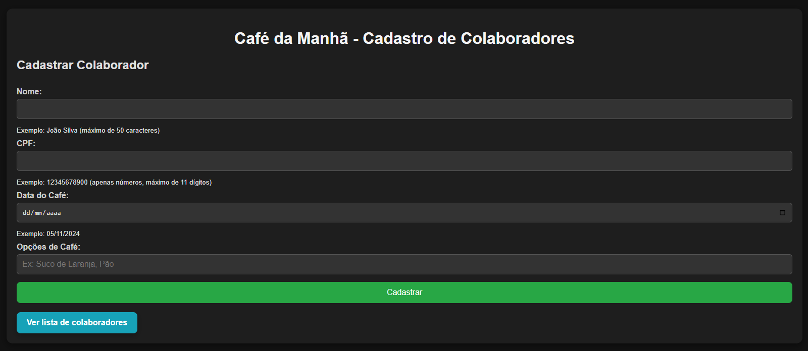
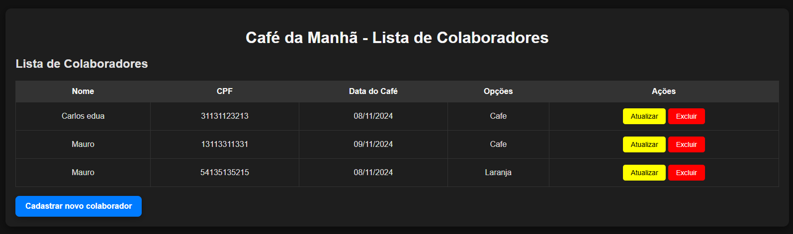
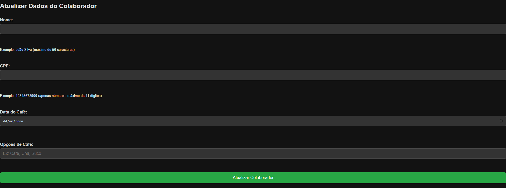

# Café da Manhã - Gestão de Participantes

Este projeto é uma aplicação web para organizar os participantes dos cafés da manhã da empresa. Os colaboradores podem informar o que vão trazer para o café da manhã, e é possível marcar se trouxeram os itens no dia do evento.

## Funcionalidades

- Cadastro de participante com nome, CPF, opções de alimentos/bebidas e data do café.
- Exibição da lista de participantes com o que planejam trazer.
- Validação para evitar:
  - Duplicação de CPFs e opções para a mesma data.
  - Data de café da manhã no passado.

## Tecnologias Utilizadas

- **Frontend**: HTML, CSS, JavaScript (puro)

- **Backend**: Java, Spring Boot, PostgreSQL, JPA, Native Querys.

## Pré-requisitos
- **VS CODE** com extensão live server

## Como Funciona
- A página de cadastro permite que os participantes se registrem com seu nome, CPF, o que irão trazer para o café da manhã e a data do evento.
- A lista de participantes é atualizada em tempo real conforme as informações são inseridas.
- O código valida se os CPFs são duplicados ou se a data do evento é válida.

# Link para a aplicação:
https://desafio-sulworktech-production-app.up.railway.app/index.html

